[](https://classroom.github.com/a/YyUO0xtt)
# COMP2150  - Level Design Document
### Name: Mark Dino
### Student number: 47728191

This document discusses and reflects on the design of your platformer level for the Level Design assessment. It should be 1500 words. Make sure you delete this and all other instructional text throughout the document before checking your word count prior to submission. Hint: You can check word count by copying this text into a Word or Google doc.

Your document must include images. To insert an image into your documentation, place it in the "DocImages" folder in this repo, then place the below text where you want the image to appear:

```

```

Example:


## 1. Player Experience (~700 words)
Outline and justify how your level design facilitates the core player experience goals outlined in the assignment spec. Each section should be supported by specific examples and screenshots of your game encounters that highlight design choices made to facilitate that particular experience.

### 1.1. Discovery
What does the player learn? How does your encounter and broader level design facilitate learning in a way that follows good design practice?

-------------------------------------------------------------------------------------------------------------------------

The player experience of discovery in my level design can be found incorporated at various stages, but heavier into the later stages (sections 2 & 3), as section 1 is heavily linear. Once the player is loaded into the level, there isn’t much of a context to where the player is, accentuated by the confusion of the player character, forcing them to explore the cavern and avoid dangers. Once the player is about finished at the exit of the first section of the level, a breakable wall is found amongst health containers. The player notices that they can’t do anything to it and are forced to leave.

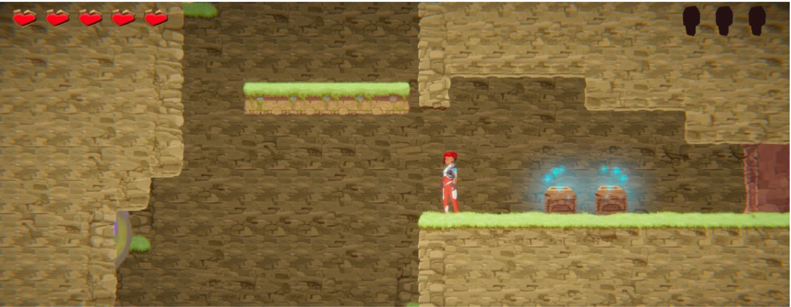


It is only until reaching the ‘caverns’ section that they receive the staff item, and the ability to melee attack. Assuming the player knows the controls, the player being trapped in a small room allows them to discover that they can destroy walls, and attack enemies in a controlled environment. The player in section 2 gives them the option to explore, and piece together information, such as them discovering the switch at the end of the room activates the movable platform found near the start of the section. Section 3 involves puzzle solving, and for the player to discover the mechanics to how each room is solved, such as pressure pads and switches. 

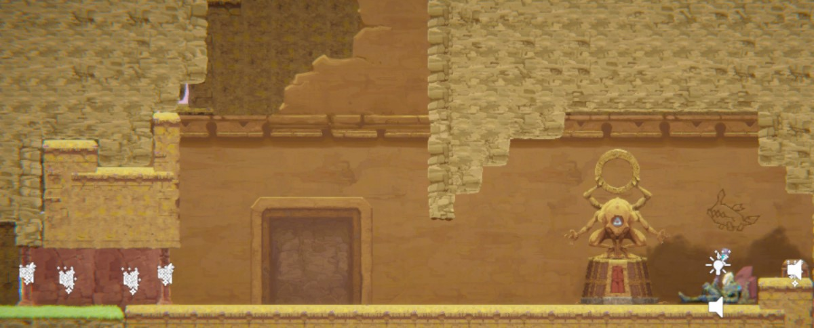


### 1.2. Drama
What is the intensity curve? How does your design facilitate increasing yet modulating intensity, with moments of tension and relief? 

 -------------------------------------------------------------------------------------------------------------------------

The initial spawn and the first section is meant to be a tutorial / easy starting area, bringing platforming based ease to the game, and each challenge room is broken in between with rest rooms to relax, some scattered with health and to help prepare for the next challenge room. After gaining a key and continuing forward to see the other directions the player can go, each subsequent room becomes slightly harder. With the player being given the ability to defend themselves against enemies, section 2 is ramped up to be more of an intense room all throughout, with enemies scattered throughout the level with minimal time or places to relax. Section 3 finishes by slowing down the intensity with puzzle solving, scattered with a little bit of enemies but focusing mainly on solving puzzles to the key. 


### 1.3. Challenge
What are the main challenges? How have you designed and balanced these challenges to control the difficulty curve and keep the player in the flow channel?

-------------------------------------------------------------------------------------------------------------------------

Challenge for the most part, ramps up in each section until reaching a final room, in which a final challenge is presented for the player to conquer. Usually at the beginning of each section, there would be a room for the player to become familiar with each part of the game mechanics, then once they progress forward, they’ll encounter those mechanics in a more complex way. In section 1, players are familiarized with the mechanics of moving platforms, drop down platforms and dangers such as acid and spikes. The rooms afterwards are complex versions of those mechanics for the player to control, being used in ways the player would have to avoid. The same process is used for section 2, where the player finds the staff and encounters a chomper in a controlled environment. Afterwards the player finds a whole room dedicated to chompers and spitters spread amongst the level, and has to deal with many of them for the remainder of the level. In section 3, the difficulty comes more in the form of puzzles and intellect. There are a whole variety of challenges throughout the level, from platforming to combat to puzzle solving. For difficulty balance, the puzzles presented aren’t as complex in section 3, and require only a little bit of thinking of the solution to each puzzle. In section 2 however, for difficulty balance the enemies are killed in one hit, so having many of them scattered about in different platforms helps counteract the overall weakness of some of them. In general, the spitters’ overall range isn’t as complex or large, and the player won’t have as much trouble trying to avoid their attacks if put across the room. So to counteract that, having some spots where they are strategically placed while the player moves around platforms, they are forced to avoid them rather than try to fight them.  

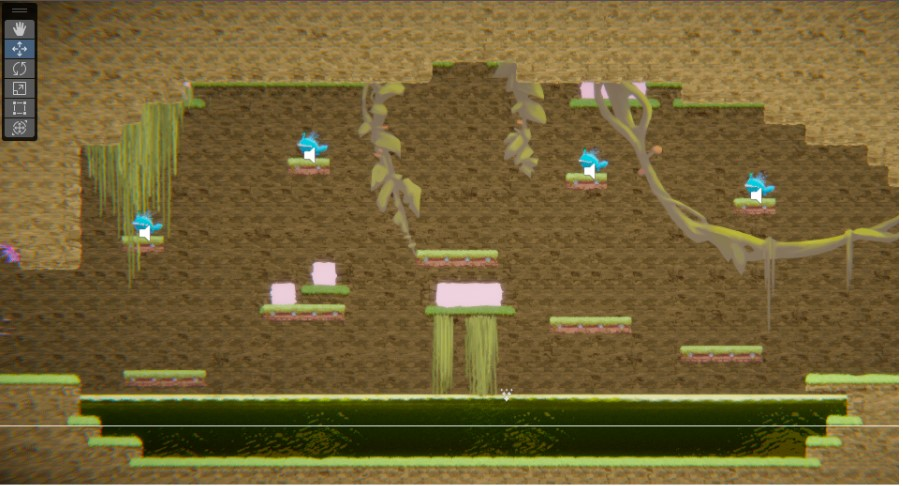


### 1.4. Exploration
How does your level design facilitate autonomy and invite the player to explore? How do your aesthetic and layout choices create distinct and memorable spaces and/or places?

-------------------------------------------------------------------------------------------------------------------------

In my level, exploration becomes prevalent more once the player arrives in the main hub area with the exit door. They’re incentivized to choose one of the two branching paths to proceed to the next section, and normally exploration rewards them with health kits. Exploring either direction would reward a weapon (whether staff or gun), but each weapon is only used in the section that they came from without much overlap. Each section is created so that they each stand out as much as they can. Sections 1 & 2 may look the most similar, but section 2 holds more abandoned environments and broken down places, but since they are both in the cavernous areas, they both are riddled with roots and overgrown foliage. Section 3 is held more in a temple-like area, with fully built-in walls, statues and decorations. The illusion of exploration is used mainly in section 2, where the player is given a choice to explore upwards or continue forward. Exploring upwards shows you a deactivated bridge, but not allowing you to go forward, and forcing you to go back the other way.


## 2. Core Gameplay (~400 words)
A section on Core Gameplay, where storyboards are used to outline how you introduce the player to each of the required gameplay elements in the first section of the game. Storyboards should follow the format provided in lectures.

Storyboards can be combined when multiple mechanics are introduced within a single encounter. Each section should include a sentence or two to briefly justify why you chose to introduce the mechanic/s to the player in that sequence.

You should restructure the headings below to match the order they appear in your level.

### 2.1. Acid

### 2.2. Checkpoints

### 2.3. Chompers

### 2.4. Health Pickups

### 2.5. Keys

### 2.6. Moving Platforms

### 2.7. Passthrough Platforms

### 2.8. Spikes

### 2.9. Spitters

### 2.10. Weapon Pickup (Gun)

### 2.11. Weapon Pickup (Staff)

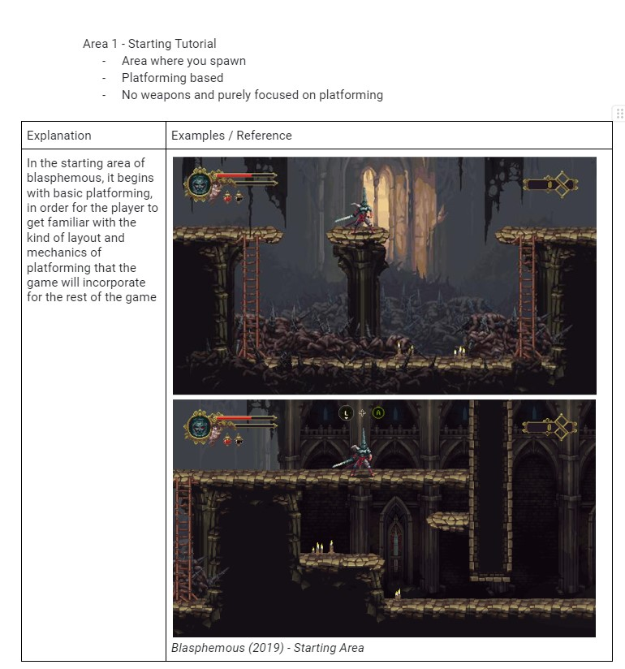
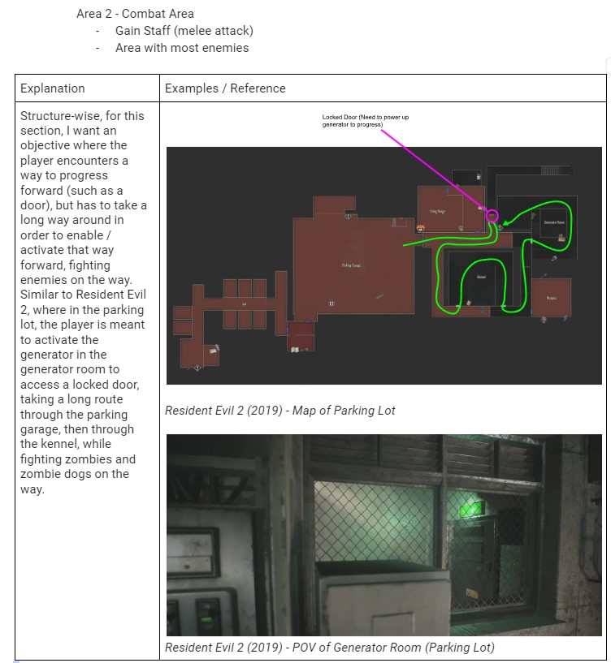
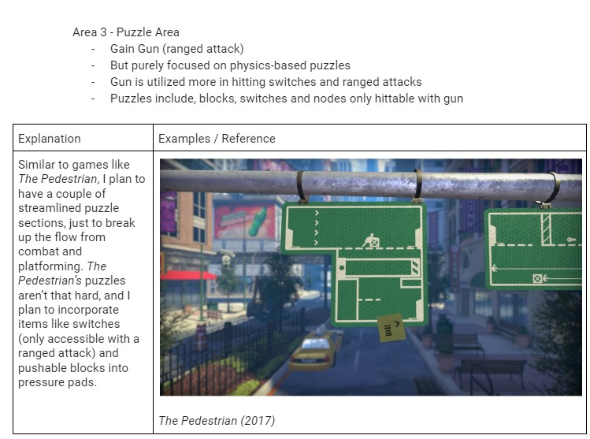


## 3. Spatiotemporal Design
A section on Spatiotemporal Design, which includes your molecule diagram and annotated level maps (one for each main section of your level). These diagrams may be made digitally or by hand, but must not be created from screenshots of your game. The annotated level maps should show the structure you intend to build, included game elements, and the path the player is expected to take through the level. Examples of these diagrams are included in the level design lectures.

No additional words are necessary for this section (any words should only be within your images/diagrams).
 
 -------------------------------------------------------------------------------------------------------------------------

### 3.1. Molecule Diagram
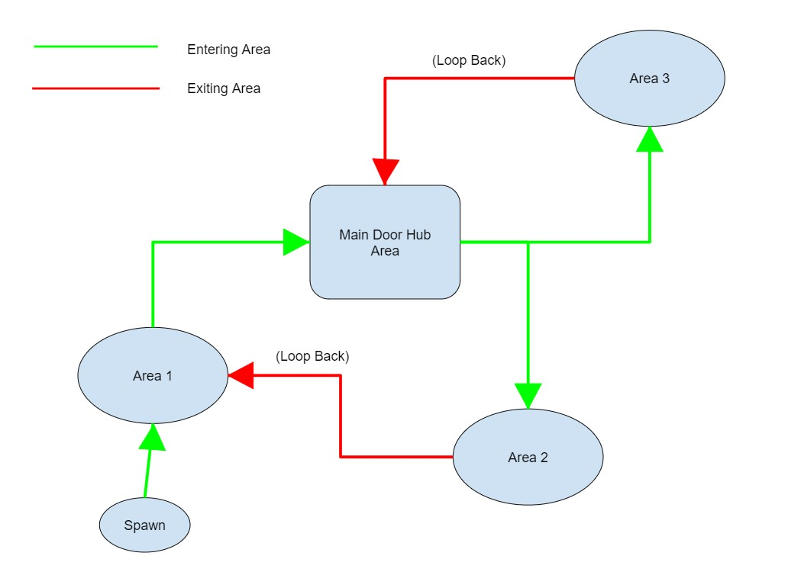


### 3.2. Level Map – Section 1
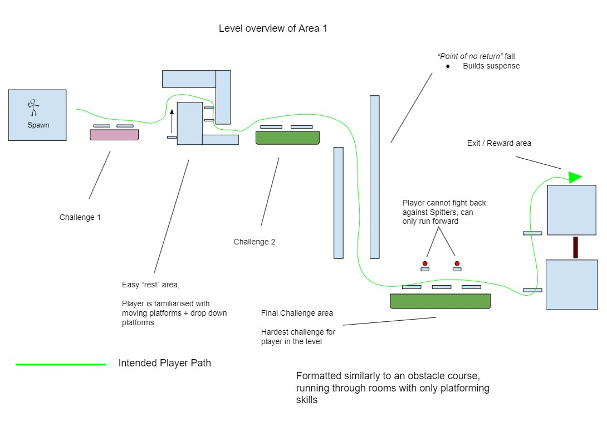


### 3.3. Level Map – Section 2
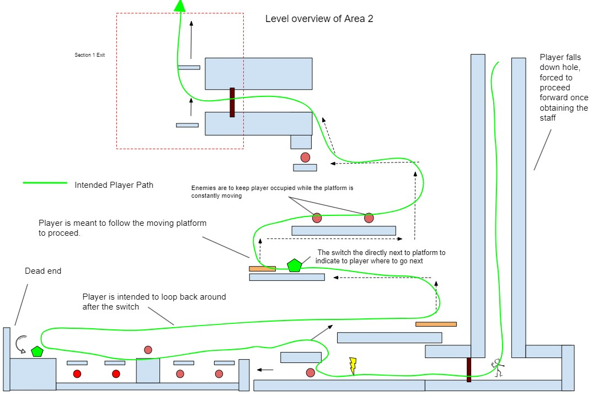


### 3.4. Level Map – Section 3
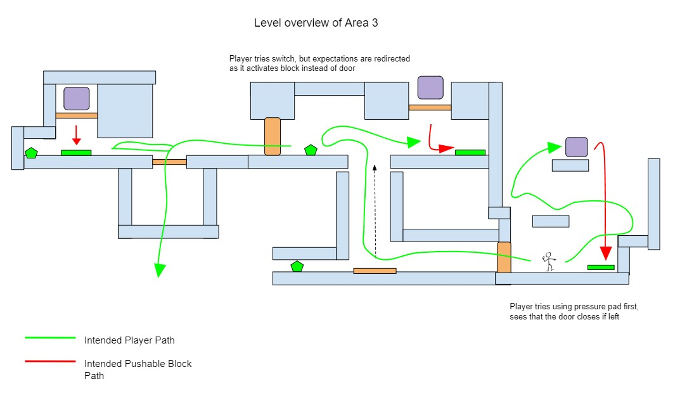


## 4. Iterative Design (~400 words)
Reflect on how iterative design helped to improve your level. Additional prototypes and design artefacts should be included to demonstrate that you followed an iterative design process (e.g. pictures of paper prototypes, early grey-boxed maps, additional storyboards of later gameplay sequences, etc.). You can also use this section to justify design changes made in Unity after you drew your level design maps shown in section 3. 

You should conclude by highlighting a specific example of an encounter, or another aspect of your level design, that could be improved through further iterative design.

-------------------------------------------------------------------------------------------------------------------------

When developing ideas for the starting area, I had bounced through a couple ideas of rooms that ended up in the final design and had started incorporating them into the game, but upon a couple times of playtesting (with other contributing players), I ended up modifying the layout of that starting section to make it more easier. Re-reading my initial scripts and plans, I had wanted the first section to be an obstacle course of platforming for the player, but objectively easier compared to the other sections. The original draft had 4 rooms, starting with the acid room with moving platforms going all the way to the exit. After various playtesting, I changed the layout, so now the final layout has the 3rd room from the original being the one of the first the player comes across, and adding an additional room. The additional room is similar to the acid moving platform room, except its spikes and is static. I designed it to be the first room the player encounters, just to make the player experience easier at first, and allow the player to familiarize themselves with the basics of the kinds of platforms and platforming mechanics that are introduced. With this concept, I ordered it more so that each room the player progresses through gets progressively harder, up to the final room, where the player encounters a room of spitters with no defense as the final challenge before finishing the section and obtaining the first key.

.jpg)

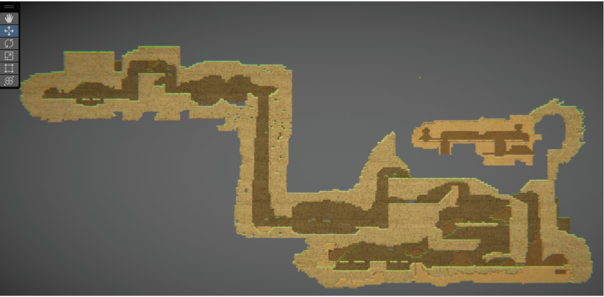


## Generative AI Use Acknowledgement

Use the below table to indicate any Generative AI or writing assistance tools used in creating your document. Please be honest and thorough in your reporting, as this will allow us to give you the marks you have earnt. Place any drafts or other evidence inside this repository. This form and related evidence do not count to your word count.
An example has been included. Please replace this with any actual tools, and add more as necessary.


### Tool Used: ChatGPT
**Nature of Use** Finding relevant design theory.

**Evidence Attached?** Screenshot of ChatGPT conversation included in the folder "GenAI" in this repo.

**Additional Notes:** I used ChatGPT to try and find some more relevant design theory that I could apply to my game. After googling them, however, I found most of them were inaccurate, and some didn't exist. One theory mentioned, however, was useful, and I've incorporated it into my work.

### Tool Used: Example
**Nature of Use** Example Text

**Evidence Attached?** Example Text

**Additional Notes:** Example Text


